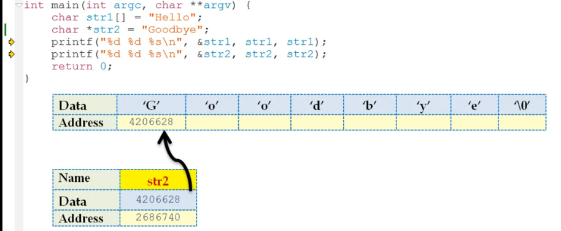

# Arrays addresses and pointers

Let's now look at how pointers and addresses work and why array is especial. In the program below we  declared two string variables `str_one[]` and `*str_two`.

You can create string variables using either syntax, but you need to understand that these two variables are by no means the same as one another.

The first `str_one[]` (declared with a pair of square brackets) is an array. The second `*str_two` (declared using the star operator) is a pointer.

```c
#include <stdio.h>

int main(int argc, char **argv)
{
    char str_one[] = "Hello";
    char* str_two = "Goodbye";

    printf("%d %d %s\n", &str_one, str_one, str_one);
    printf("%d %d %s\n", &str_two, str_two, str_two);

    return 0;
}
```

As we know, an array and an address are equivalent. So `str_one[]` is the address at which the array of characters in the string *Hello* is stored.

But `*str_two` is a pointer whose value is not the string *Goodbye*, but the address of that string. So `*str_two` points to the address at which the characters *Goodbye* are stored.

This I hope should be clear after run the program, let's do that now.

```txt
2068639362 2068639362 Hello
2068639352 4196020 Goodbye
```

Above you can see the result output.

Now as you can see when displayed as an __integer value__, the address of `str_one`, returned by the Address of operator (&), is the same as the value of the variable `str_one` itself.

```txt
2068639362
```

That's because `str_one` is an array, and an array is in effect an address.

But the address of `str_two`, returned by the Address of operator (&), is different from the value of the `str_two` variable.

```txt
2068639352 4196020
```

Above the address gives us the location in memory of the pointer variable `str_two`, but the value of that variable is the address of the array of chars to which it points, the *Goodbye* string.

Let's repeat that because it's important: an array variable such as `str_one` is an address. In fact it has its own address.

An array variable is the address of an array, but a pointer variable is not an array. It's a variable that stores the address of an array.

The pointer variable itself is stored at one address, meanwhile the array is stored at a completely different address.

Think back to the analogy we saw in the [Lesson-No1](./Lesson-No1.md) where I need to go to a specific warehouse on a road containing many warehouses. On my index card, you remember, I had the address written down *Warehouse No. 18*, and the index card is like a pointer available. It __is not__ the location, which in our example might be the address of an array, but it stores a value (that is the address) that let's me find that location. That's what a pointer variable does.

Now as for the warehouse itself, that is the physical building, we can think of that as being like our array variable. It's not just a reference to the location, it is the location itself.

Go back to the code and be sure that you really understand that before moving on.

`str_one` is the location of the start of this array of characters *Hello* in computer memory.

```c
char str_one[] = "Hello";
```

The address of `str_one` is the location where that string of chars begins.

But the value of the pointer variable `str_two` is a number that gives the location of the start of the array of characters *Goodbye* in computer memory.

```c
char* str_two = "Goodbye";
```

The address of `str_two` is the location where the `str_two` pointer variable is stored.

And if we just want to get the data in the array, the address of the pointer variable itself is of no interest to us.

The address of pointer variables will however be of interest later on. But for now we're only interested in the address of the array to which this pointer points.

The value of `str_two` is the address of the array, the address of the first character in the string *Goodbye*, like that:



In other words, the value of the pointer variable refers to, or points to, the address of the array.

If you still finding this confusing try playing around with this code.

For example, let's try an experiment.

Let's set `str_two` our pointer variable to the address of `str_one`, like this:

```c
str_two = &str_one;
```

Now if you run the program the output should be something similar to this:

```txt
78481778 78481778 Hello
78481768 78481778 Hello
```

So the value of the pointer `str_two` is now the address of the array *Hello*. So `str_two` can be thought of as pointing to the string *Hello*.

Now instead of assigning the address the string array `str_one` let's try assigning the array itself:

```c
str_two = str_one;
```

Run the program again:

```txt
-1522873150 -1522873150 Hello
-1522873160 -1522873150 Hello
```

Well we get exactly the same results as before. That's because, as I've already said, an array is an address.
